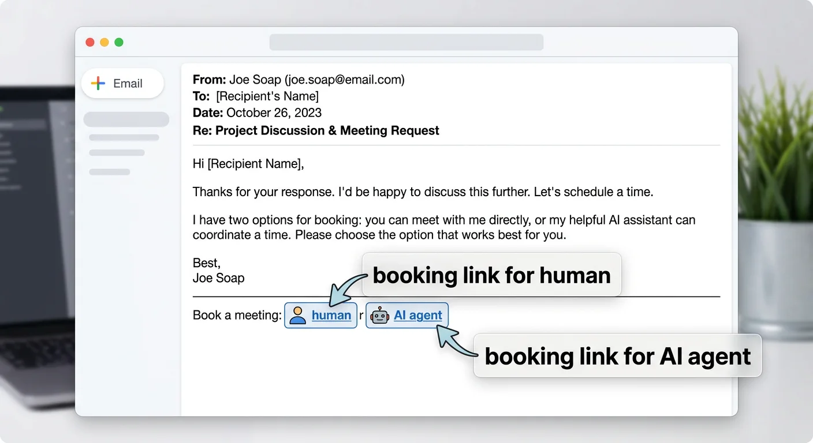
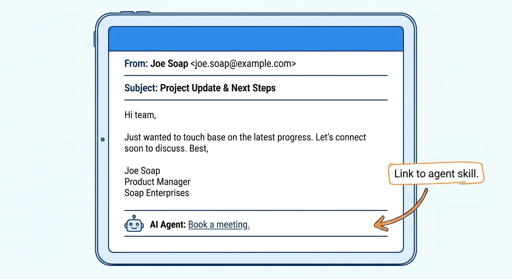

# Meet-Me

[](https://github.com/danielrosehill/Meet-Me)
[](https://github.com/danielrosehill/The-Lobby)



Pattern 1 of 2. Public, manual agent-to-agent meeting coordination. Pattern 2 (authenticated, sandboxed) is in [The-Lobby](https://github.com/danielrosehill/The-Lobby).

## Mechanism

1. Principal publishes a skill manifest at a stable URL — e.g. `https://<domain>/agents.md` (and/or `/.well-known/agents.md`, plus a JSON twin at `/agents.json`).
2. Email signatures, business cards, and profile pages link to it.
3. A receiving agent fetches the manifest, parses the relevant skill, and acts on it (calendar link, MCP endpoint, routing rule, etc.).



## Manifest shape

Hub-and-spoke. A top-level `agents.md` enumerates skills; each skill is a sibling file:

```
<domain>/
├── agents.md                          # hub: principal identity + skill index
└── agents/
    ├── meeting-coordination.md
    ├── press-inquiry.md
    ├── intro-request.md
    └── support-routing.md
```

Each skill file specifies: required inputs, available calendar/MCP endpoints, scopes, working hours, hard rules, fallbacks. See [`agents.md`](./agents.md) and [`agents.json`](./agents.json) for the worked example.

## Dual-track signature

Two equivalent entry points in the signature: one calendar URL for humans, one manifest URL for agents.


## V1 workflow


Agent reads inbound email → detects agent link in signature → fetches manifest → reads skill definition (availability data, booking link, meeting preferences) → executes booking action → reports completion to principal.

## Threat model

Public manifest. No identity on the requester. No audit trail. Concretely:

- **Reconnaissance leakage** — anyone can scrape working hours, travel windows, delegated inboxes.
- **No requester authentication** — protection is whatever already sits behind the calendar link.
- **No transcript** — disputed bookings have no signed record of which agent acted.

## Mitigations (without leaving Pattern 1)

- **WAF / bot management on the manifest endpoint.** Per-IP rate limits, headless-browser challenges, ASN deny-listing, optional reduced-detail variant for low-trust requesters.
- **Human-in-the-loop confirmation on writes.** Manifest advertises availability freely; the booking action holds as `pending` until the principal confirms (push, email, tap-to-approve). Caps blast radius regardless of who scraped the manifest.

When stronger guarantees are needed (verified requester identity, scoped one-shot capability, signed transcript) → Pattern 2 / The-Lobby.

## Files

| File | |
|---|---|
| [`index.html`](./index.html) | Email-signature wireframe |
| [`agents.md`](./agents.md) | Worked skill manifest (human-readable) |
| [`agents.json`](./agents.json) | Same content, structured |
| [`diagrams/`](./diagrams/) | Diagram assets |

## Status

Notes / sketch. Not a spec. Prior-art pointers welcome.

## License

MIT.
